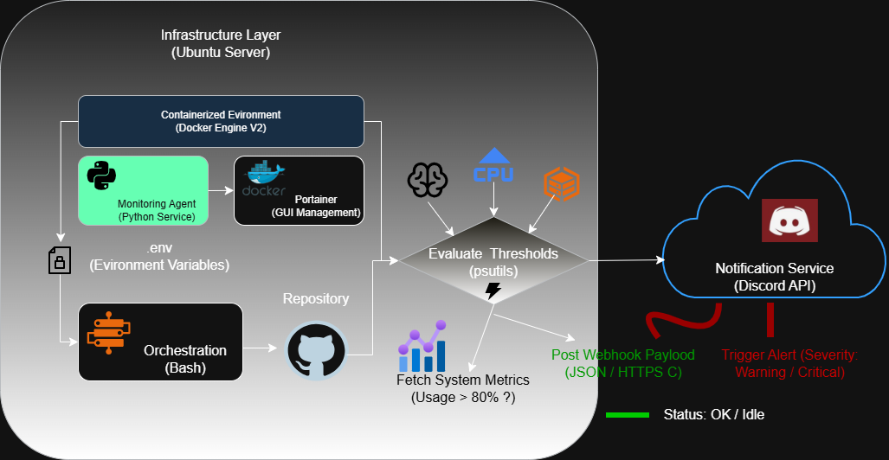

# 🚀 System Monitor: Real-time Resources to Discord

Este projeto consiste em um agente de monitoramento resiliente, desenvolvido em **Python**, que monitora métricas críticas de hardware (CPU, RAM e Disco) e envia alertas inteligentes para um canal do **Discord** via Webhooks.

O sistema foi projetado com foco em princípios de **DevOps**, utilizando conteinerização e boas práticas de segurança.

## 🛠️ Tecnologias Utilizadas

* **Python 3.12**: Lógica do monitor e coleta de métricas (`psutil`).
* **Docker & Docker Compose V2**: Orquestração e isolamento do ambiente.
* **Discord Webhooks**: Interface de saída para alertas em tempo real.
* **Dotenv (.env)**: Gestão segura de variáveis de ambiente.

## 🏗️ Arquitetura do Sistema



1.  **Host (Ubuntu Server)**: Onde o monitor extrai os dados brutos de hardware.
2.  **Container Docker**: Isola a aplicação, garantindo que ela rode em qualquer servidor.
3.  **Segurança**: A URL do Webhook nunca é exposta no código, sendo carregada via arquivo `.env`.
4.  **Lógica de Severidade**:
    * **Uso < 80%**: Silencioso (estável).
    * **Uso >= 80%**: Alerta de Atenção (Amarelo).
    * **Uso >= 95%**: Alerta Crítico (Vermelho).


## 🚀 Como Executar

1. **Clone o repositório:**
   ```bash
   git clone [https://github.com/ppachecob/monitoramento-devops.git](https://github.com/ppachecob/monitoramento-devops.git)
   cd monitoramento-devops

## 🤖 Automação e Pipeline CI/CD Local

Para otimizar o ciclo de desenvolvimento e operação, foi implementado um pipeline de automação (`automate_all.sh`). Este script atua como um orquestrador local, realizando as seguintes etapas:

1. **Sincronização (Pull)**: Garante que o servidor esteja executando a versão mais recente do código presente no repositório remoto.
2. **Deploy Contínuo**: Realiza o rebuild automático e a reinicialização dos containers utilizando Docker Compose V2, garantindo que mudanças no `.py` ou no `Dockerfile` sejam aplicadas imediatamente.
3. **Backup de Estado (Push)**: Automatiza o versionamento de novas alterações de configuração ou documentação, realizando o commit e push para o GitHub via SSH.

Este workflow elimina erros manuais, garante a integridade do ambiente e facilita a manutenção do agente de monitoramento.

## Título: Agente de Monitoramento de Recursos com Foco em Resiliência e DevOps

Este projeto foi desenvolvido para monitorar métricas críticas de servidores Ubuntu (CPU, RAM e Disco) em tempo real, integrando notificações via Discord Webhooks. O objetivo principal foi aplicar conceitos avançados de Engenharia de Software e práticas de DevOps para garantir a estabilidade de infraestruturas locais.

Destaques Técnicos:

Docker & Docker Compose V2: Orquestração de serviços para garantir um ambiente isolado e reprodutível.

Automação de CI/CD: Implementação de um pipeline em Bash para sincronização automática com GitHub e deploy contínuo.

Segurança: Gerenciamento de credenciais via variáveis de ambiente (.env) e autenticação segura via SSH.

Python (psutil): Coleta eficiente de métricas do sistema com lógica de alertas baseada em severidade (Atenção/Crítico).

“Com quase duas décadas de experiência em logística, este projeto reflete minha transição para a tecnologia, aplicando a mentalidade de eficiência operacional ao monitoramento de dados e automação de sistemas.”


## Title: Resource Monitoring Agent with a Focus on Resilience and DevOps

This project consists of a monitoring agent developed in Python to track critical server metrics (CPU, RAM, and Disk) and send real-time alerts via Discord Webhooks. The goal was to implement Software Engineering principles and DevOps practices to ensure infrastructure stability.

Technical Highlights:

Docker & Docker Compose V2: Containerization for a consistent and isolated deployment environment.

CI/CD Automation: Bash scripts for automatic GitHub synchronization and seamless deployments.

Security: Environment variable management (.env) and secure SSH authentication.

Python (psutil): Efficient hardware metric collection with severity-based alert logic.